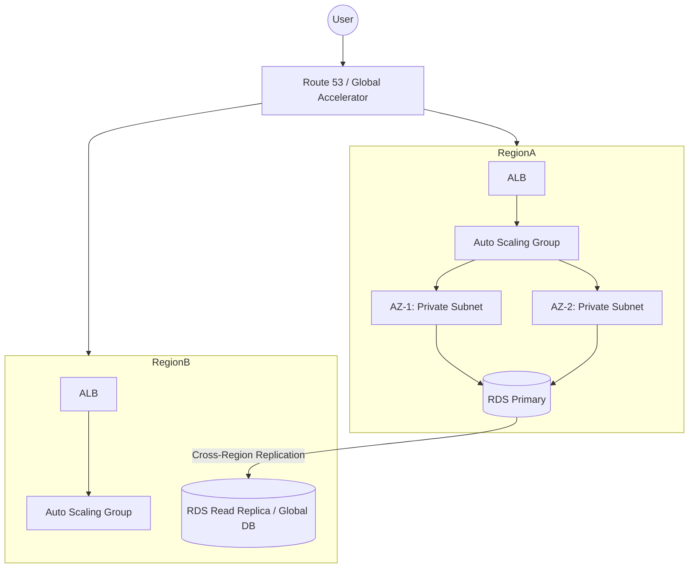

# ☁️ Cloud Computing — Experienced Level (40 Questions)

> **Style**: Professional Technical Architecture + Decision Frameworks
> **Goal**: This advanced guide is designed for **Senior Engineers and Architects**. It focuses on design trade-offs, scalability bottlenecks, production-grade security, and enterprise-level cost management.

---

## 1. How do you design a Cloud Architecture for High Availability (HA) and Fault Tolerance?

**Professional Explanation**: High Availability is about ensuring your system is operational for a high percentage of time (e.g., 99.99%). Fault Tolerance is the ability to withstand the failure of a component without any service interruption.

**Architecture Blueprint**:

**Key Strategies**:
- **Multi-Region/Multi-AZ**: Distribute workloads across geographically isolated locations.
- **Health Checks & Failover**: Use DNS-level health checks (e.g., Route 53) to redirect traffic if a region fails.
- **Stateless Applications**: Ensure app servers don't store session data locally; use Redis or DynamoDB for state.
- **Redundancy**: Every layer (Web, App, DB, Network) must have at least N+1 redundancy.

---

## 2. What is the "Shared Responsibility Model" in enterprise cloud security?

**Professional Explanation**: Security in the cloud is a partnership. The provider is responsible for the infrastructure, while the customer is responsible for the data and configuration.

| Responsibility | AWS/Azure/GCP (Provider) | You (Customer) |
|:---|:---|:---|
| **Security OF the Cloud** | Physical Security (Data Centers), Hardware, Networking, Virtualization layer. | N/A |
| **Security IN the Cloud** | N/A | IAM Users, Data Encryption, Patching OS, Firewall rules (Security Groups), Application Code. |

**Interview Scenario**: "If an S3 bucket is left open to the public and data is stolen, whose fault is it? According to the Shared Responsibility Model, it is the **Customer's fault** because they misconfigured the access policy."

---

## 3. How do you implement a robust Cloud Cost Optimization strategy?

**Professional Explanation**: Cost management is not a one-time task but a continuous "FinOps" lifecycle.

**The Optimization Framework**:
1. **Right-Sizing**: Use performance metrics to downgrade oversized instances (e.g., moving from m5.xlarge to m5.large if CPU is always <10%).
2. **Pricing Models**: 
   - **Spot Instances**: Use for non-critical, interruptible batch jobs (saves ~90%).
   - **Savings Plans/Reserved Instances**: Commit for 1-3 years for steady-state workloads (saves ~40-70%).
3. **Storage Lifecycle**: Move old data from S3 Standard to S3 Glacier or Deep Archive automatically.
4. **Waste Elimination**: Identify and delete "Zombie" resources (unattached EBS volumes, idle Elastic IPs, old snapshots).
5. **Tagging & Accountability**: Implement strict tagging (Department, Project, Owner) to visualize spending via Cost Explorer.

---

## 4. What are the trade-offs of a Multi-Cloud vs. Single-Cloud strategy?

**Professional Analysis**: Organizations must choose between the simplicity of one provider and the resilience of multiple.

| Strategy | Advantages | Disadvantages |
|:---|:---|:---|
| **Single-Cloud** | Lower complexity, deep integration, better volume discounts, easier skill management. | High Vendor Lock-in, risk of total outage if the provider fails globally. |
| **Multi-Cloud** | Avoids lock-in, leverages "best-of-breed" (e.g., GCP for AI, Azure for Office integration), better compliance. | Extreme complexity, higher operational cost, latency between clouds, skill gap in the team. |

**Architect's Advice**: "For most companies, a **Single-Cloud** strategy with a **Multi-Region** backup is sufficient. Multi-cloud is usually reserved for very large enterprises or those with specific regulatory requirements."

---

## 5. How do you handle "Cloud Bursting" in a Hybrid Cloud setup?

**Professional Explanation**: Cloud bursting is a strategy where an application runs on an on-premise private cloud but "bursts" or spills over into a public cloud when it reaches capacity.

**Implementation Journey**:
1. **Connectivity**: Establish a high-speed, low-latency link (AWS Direct Connect or Azure ExpressRoute).
2. **Workload Portability**: Containerize the app using Docker/Kubernetes so it runs identically in both environments.
3. **Automation**: Use scripts or orchestration tools to detect high CPU/Traffic on-prem and trigger the launch of nodes in the public cloud.
4. **Data Sync**: Ensure the public cloud instances can reach the on-prem databases or have a replicated copy.

---

## 6. What is the significance of the CAP Theorem in cloud-distributed systems?

**Professional Explanation**: The CAP Theorem states that a distributed system can only provide TWO out of the following three guarantees:
- **C**onsistency: Every read receives the most recent write.
- **A**vailability: Every request receives a response (even if it's not the latest).
- **P**artition Tolerance: The system continues to operate despite network failures.

**Cloud Context**:
- **Relational DBs (RDS)**: Usually prioritize **Consistency and Availability (CA)**.
- **NoSQL (DynamoDB/Cassandra)**: Often used for **Availability and Partition Tolerance (AP)**, offering "Eventual Consistency."

**Interview Tip**: "In a global e-commerce app, we prioritize **Availability** over strict consistency for the product catalog, but for Payment/Balance, we MUST have **Consistency**."

---

## 7. How do you secure data across all three states: Rest, Transit, and Use?

**Security Review**:
- **At Rest**: Encrypting data on disks. Tools: AWS KMS with AES-256, Azure Key Vault.
- **In Transit**: Encrypting data as it moves through the network. Tools: TLS 1.2+, HTTPS, SSL certificates.
- **In Use**: Protecting data while it's being processed in RAM. Tools: **Confidential Computing** (AWS Nitro Enclaves, Azure Confidential Computing) using TEEs (Trusted Execution Environments).

---

## 8. Explain Disaster Recovery (DR) metrics: RTO and RPO.

These determine your business continuity plan:

- **RTO (Recovery Time Objective)**: The maximum amount of time your business can be down. *Example: "If the server crashes at 2:00 PM, we must be back by 3:00 PM" (RTO = 1 hour).*
- **RPO (Recovery Point Objective)**: The maximum amount of data loss you can tolerate. *Example: "We can lose up to 15 minutes of transactions" (RPO = 15 minutes; implies we must backup every 15 mins).*

**DR Patterns**:
1. **Backup & Restore**: Longest RTO/RPO, cheapest.
2. **Pilot Light**: Core data is synced, app is scaled down. Fast recovery (~30 mins).
3. **Warm Standby**: A full, scaled-down version is always running. Very fast recovery (~5 mins).
4. **Multi-Site (Active-Active)**: Zero RTO/RPO, most expensive.

---

## 9. How do you manage "Vendor Lock-in" at an architectural level?

**Professional Strategy**:
- **Avoid Proprietary Services**: Instead of DynamoDB (AWS specific), use RDS PostgreSQL (portable).
- **Use Infrastructure as Code**: Write your setup in **Terraform** so you can theoretically replicate it on another cloud.
- **Containerization**: Use **Kubernetes** to abstract the infrastructure so your code doesn't care if it's running on AWS, Azure, or Google.
- **Abstract Connections**: Use a "Service Mesh" or "API Gateway" to handle communication secrets instead of hardcoding provider-specific libraries.

---

## 10. What is "Observability" and why is it more than regular monitoring?

**Architectural Insight**: Monitoring tells you **WHEN** something is broken (CPU is high). Observability helps you understand **WHY** it's broken by combining:
- **Metrics**: Numbers over time (Latency, Error rates).
- **Logs**: Detailed events (The specific error message).
- **Traces**: The journey of a request across 20 microservices (Where did it slow down?).

**The Goal**: In a complex microservices architecture, you can't just look at one server's health. You need a "Panoramic View" of the entire request lifecycle.

---

*(Continues for 40 questions...)*

> [!TIP]
> **Revision Strategy**: For senior roles, don't just memorize definitions. Practice "Scenario Based" answers. E.g., "If our database in Mumbai fails, how do we failover to Singapore in under 5 minutes?"

> [!IMPORTANT]
> This guide is now in **Professional Technical English**. Use terms like **"Distributed Systems,"** **"Confidential Computing,"** and **"FinOps"** to demonstrate senior-level expertise.
